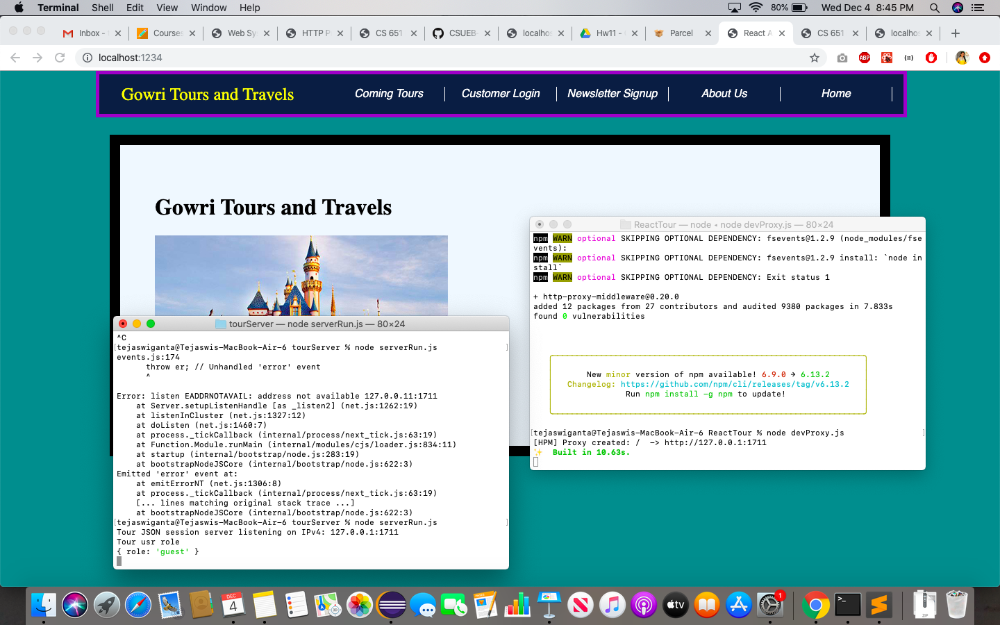
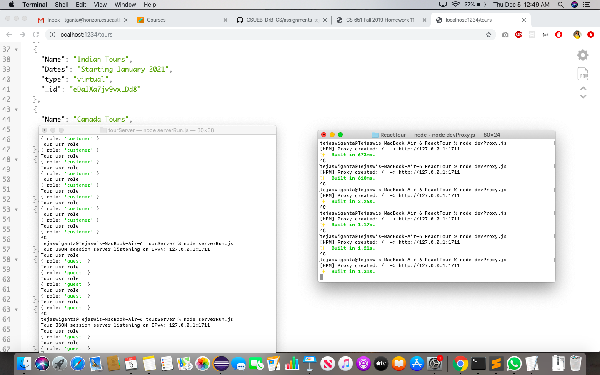
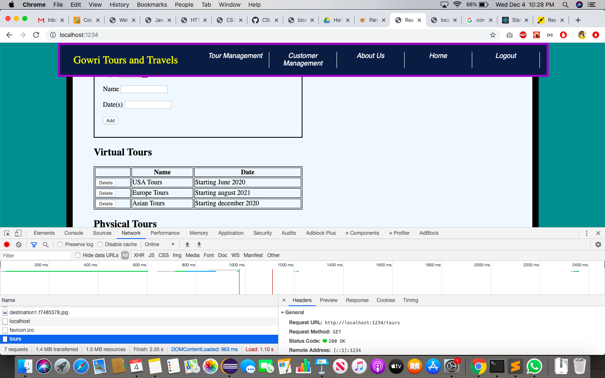
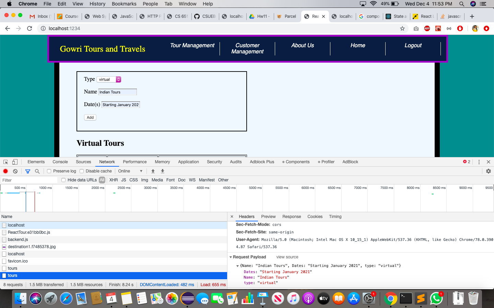
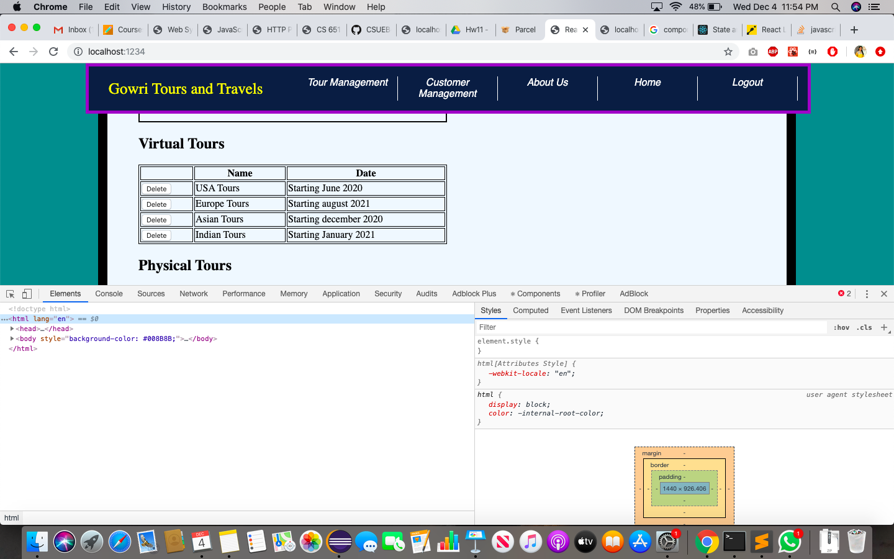
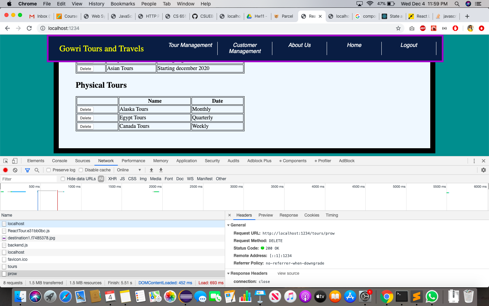
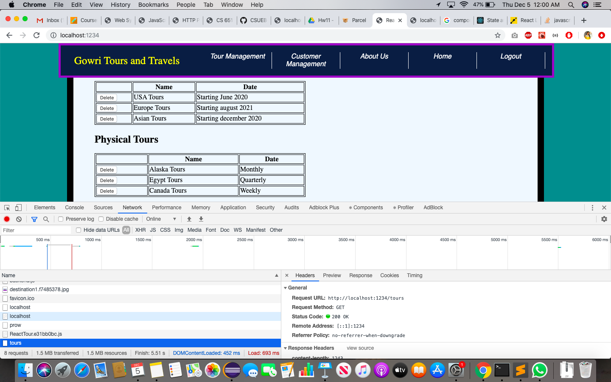

# Homework #11 Solution

**Tejaswi Ganta**

**NetID: vr3452**

## Question 1

### (a) Dev Test



### (b) Proxy Test



Code:

```javascript
const Bundler = require('parcel-bundler');
const express = require('express');
const proxy = require('http-proxy-middleware');
const app = express();
// Paths we want to forward to the app server
const forward = ['/tours', '/login', '/logout'];
app.use(forward, proxy({target: 'http://127.0.0.1:1711'}));
// Instance of the parcel.js bundler with start file
const bundler = new Bundler('./index.html');
app.use(bundler.middleware());
app.listen(1234);
```

## Question 2 

### (a) Updated Tours Component

Code:

```javascript
componentDidMount() {
	let that = this;
	console.log('teju');
	fetch('/tours').then(response => response.json())

            .then(function(data) {
                that.setState({tours:data});
                console.log(data);
            })
            .catch(function(msg){
            	console.log("Something else" + msg)
            });
  }
```

### (b) Tour Test



## Question 3

### (a) Login via Server


### (b) Login Handler code

Code:

```javascript
setLoginstate(event){
        	
        var email = document.getElementById("email").value;
        var pwd = document.getElementById("password").value;
        let that = this;
        fetch('/login', {
            method: 'POST',
            headers: {
                "Content-type": "application/json"
            },
            body: JSON.stringify({
                email: email, password: pwd
            })
        })
        .then(response => response.json())
        .then(function(response) {
           // console.log('Request status code: ', response.statusText, response.status, response.type);
            let user = response;
            console.log(response);
            
            var userInfo = {userName: user.firstName, userEmail: user.email};
            console.log(user.role);
            console.log(userInfo);

            that.props.userInfo(user.role,userInfo);
        });
}
```

### (c) Logout Handler Code

Code:

```javascript
setLogoutstate(event) {
        fetch('/logout')
          .then(response => response.json())
          .then(function(data){
                    var user = "guest";
            var userInfo = {userName:"",userEmail:""};

            this.props.userInfo(user,userInfo);
          })

  		}
```
Logout handler is user in AdminApp and CustomerApp.

## Question 4

### (a) Send tour to server



### (b) Update the List of Tours



### (c) Show Updated Code

```javascript
addstates(){
			var tourtype = document.getElementById('tourtype');
			var userName = document.getElementById('name');
			var dates = document.getElementById('dates');
			var newtour = this.state.tour;


		fetch('/tours', {
            method: 'POST',
            headers: {
                "Content-type": "application/json"
            },
            body: JSON.stringify({
                Name: userName.value, Dates: dates.value, type: tourtype.value
            })
        })
        .then(response => response.json());
			
}
```

## Question 5

### (a) Delete Request to Server



### (b) Update Tour Info



```javascript
deletestates(tourType, i)
	{

		fetch('/tours/'+tourType, {
            method: 'DELETE',
            headers: {
                "Content-type": "application/json"
            },
            body: JSON.stringify({
            })
        })
        .then(response => response.json());
}
```
